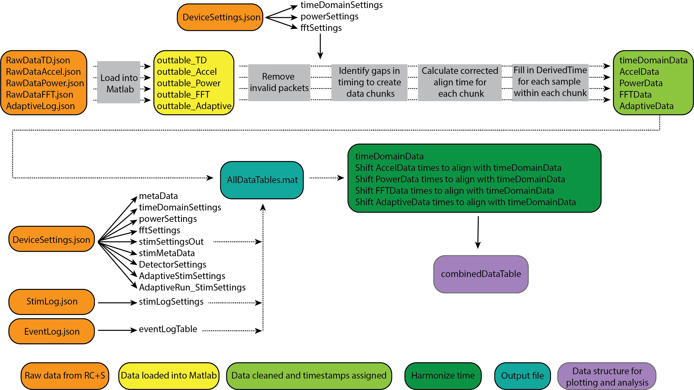

# Analysis-rcs-data
Selection of Matlab functions to extract .json raw data from Summit RC+S device, transform it to .mat format and manipulate it for initial stages of data analysis. More detail of processing flow below. 

**Background**: UCSF teams are working with Summit RC+S (RCS) devices for adaptive neurostimulation and need a validated data analysis framework to further the research. 

**Aim**: To consolidate a set of matlab functions for accessing RCS data from .json files and transforming it into data formats that enables further data analyses.

**Collaborators**: Simon.Little@ucsf.edu, Prasad.Shirvalkar@ucsf.edu, Roee.Gilron@ucsf.edu, Kristin.Sellers@ucsf.edu, Juan.AnsoRomeo@ucsf.edu, Kenneth.Louie@ucsf.edu (stays open for more colleagues to join...)

**Policy**: Master will contain functions that have been tested in branch and pushed after pull request reviewers have approved. The collaborator doing the initial development and testing of a function in a testing branch (e.g. in 'importRawData') will make a pull request and assign 1-2 reviewers of the group who will review the code structure and the output of each function.

## Installation Instructions:
- Compatibility - Mac or PC. We rely on a toolbox to open .json files which does not work on Linux. Requires **Matlab R2019a or prior**. The toolbox we rely on to open .json files is not compatible with Matlab R2019b
- Clone this repository and add to Matlab path. 

## What is the RC+S native data format?
The Medtronic API saves data into a session directory. There are 11 .json files which are created for each session, which contain both meta-data and numerical data. These files can contain data from streaming up to 30 hours if streaming time domain data or even longer if streaming power domain data; the limit to this duration is dictated by the max INS battery life. 

There are multiple challenges associated with these .json file and analyzing them: Interpreting metadata within and across the files, handling invalid / missing / misordered packets, creating a timestamp value for each sample, aligning timestamps (and samples) across data streams, and parsing the data streams when there was a change in recording or stimulation parameters. See below for the current approach for how to tackle these challenges.

## Data parsing overview

To facilitate most standard analyses of time-series data, we would optimally like the data formatted in a matrix with samples in rows, data features in columns, and a timestamp assigned to each row. The difference in time between the rows is either 1/Fs or 1/Fs\*x, where x is any whole number multiple. (In the latter case, the user could fill the missing rows with NaNs, if desired). There are many challenges in transforming RC+S data into such a matrix. Here, we provide an overview of the overall approach. More detailed information on specific steps can be found below.

## RC+S raw data structures
Each of the .json files has packets which were streamed from the RC+S using a UDP protocol. This means that some packets may have been lost in transmission (e.g. if patient walks out of range) and/or they may be received out of order. Below is a non-comprehensive guide regarding the main datatypes that exists within each .json file as well as their organization when imported into Matlab table format. In the Matlab tables, samples are in rows and data features are in columns. Note: much of the metadata contained in the .json files is not human readable -- sample rates are stored in binary format or coded values that must be converted to Hz. 

### Data in .json files
- **RawDataTD.json**: Contains continuous raw time domain data in packet form. Each packet has timing information (and packet sizes are not consistant). Data can be streamed from up to 4 time domain channels (2 on each bore) at 250Hz and 500Hz or up to 2 time domain channels at 1000Hz. A timestamp and systemTick is only available for the last element of each data packet and timing information for each sample must be deduced. [See section below on timestamp and systemTick](https://github.com/openmind-consortium/Analysis-rcs-data/tree/DocumentationUpdate#systemtick-and-timestamp)
- **RawDataAccel.json**: Contains continuous raw onboard 3-axis accelerometry data as well as timing information. The structure and timing information is similar to the time domain files.
- **DeviceSettings.json**: Contains information about which datastreams were enabled, start and stop times of streaming, stimulation settings, and device parameters (e.g. sampling rate, montage configuration [which electrodes are being recorded from], power bands limits, etc). Many of these settings can be changed within a given recording; each time such a change is made, another packet is written to DeviceSettings.json file. 
- **RawDataFFT.json** - Contains continuous information streamed from the onboard (on-chip) FFT engine. The structure and timing information is similar to the time domain files.
- **RawDataPower.json** - Contains continuous information streamed from the on board FFT engine in select power bands. The data rate is set by the FFT engine, and can be very fast (1ms) and very slow (upper limit is in the hours or days range). This is the raw input in the onboard embedded adaptive detector. The raw power is much less data intensive than the FFT data. You can stream up to 8 power domain channels (2/each TD channel) simultaneously. Note that the actual bandpass limits are not contained in RawDataPower.json but rather in DeviceSettings.json. If these values are changed during a recording, mapping will be required from the times in DeviceSettings to the data in RawDataPower.
- **AdaptiveLog.json** - Contains any information from the embedded adaptive detector. The structure and timing information is similar to the time domain files.
- **StimLog.json** - Contains information about the stimulation setup (e.g. which group, program, rate and amplitude the device is currently using for stimulation). The structure and timing information is similar to the time domain files. Much of this information is duplicated in DeviceSettings.json.
- **ErrorLog.json**- Contains information about errors. Not currently used.
- **EventLog.json** - Contains discrete information we write into the device. These can be experimental timings or patient report of his state if streaming at home. Note that this information only contains timing information in computer time, whereas all other .json files have timing relative to (on-board) INS time. [See section below on timestamp and systemTick](https://github.com/openmind-consortium/Analysis-rcs-data/tree/DocumentationUpdate#systemtick-and-timestamp)
- **DiagnosticsLog.json** - Contains discrete information that can be used for error checking.
- **TimeSync.json**: Not currently used

Note that in each recording session, all .json files will be created and saved. If a particular datastream (e.g. FFT) is not enabled to stream, that .json file will be mostly empty, containing only minimal metadata.

### Data imported into Matlab 

- **RawDataTD.json** --> timeDomainData:
  - key0: Channel 0 on the first INS bore (assuming no bridging); contains numerical data in millivolts
  - key1: Channel 1 on the first INS bore (assuming no bridging); contains numerical data in millivolts
  - key2: Channel 2 on the first INS bore (assuming no bridging); contains numerical data in millivolts
  - key3: Channel 3 on the first INS bore (assuming no bridging); contains numerical data in millivolts
  - systemTick: 16-bit INS clock timer that rolls over every 2^16 values. Highest resolution is 100 microseconds. One value per packet, corresponding to last sample in the packet. [See section below on timestamp and systemTick](https://github.com/openmind-consortium/Analysis-rcs-data/tree/DocumentationUpdate#systemtick-and-timestamp)
  - timestamp: INS clock driven timer that does not roll over. Highest resolution is 1 second. Total elaped time since March 1, 2000 at midnight. One value per packet, corresponding to last sample in the packet. [See section below on timestamp and systemTick](https://github.com/openmind-consortium/Analysis-rcs-data/tree/DocumentationUpdate#systemtick-and-timestamp)
  - samplerate: Fs in Hz; only written in rows corresponding to last sample of each packet.
  - PacketGenTime: API estimate of when the packet was created on the INS within the PC clock domain. Estimate created by using results of latest latency check (one is done at system initialization, but can re-perform whenever you want) and time sync streaming. Only accurate within ~50ms.
  - PacketRxUnixTime: PC clock-driven time when the packet was received. Highly inaccurate after packet drops.
  - packetsizes: Number of samples per packet. Written in rows corresponding to the last sample of each packet.
  - dataTypeSequence: 8-bit packet number counter that rolls over, ranging from 0 to 255; can be used to help identify if packets are in order or are missing. Should run continuously, but instances of resetting have been observed.
  - DerivedTime: Computed time for each sample - see *Calculating DerivedTime* for more information
  
- **RawDataAccel.json** --> AccelData
  - XSamples: X-axis
  - YSamples: Y-axis
  - ZSamples: Z-axis
  - timestamp
  - samplerate
  - PacketGenTime
  - PacketRxUnixTime
  - packetsizes
  - dataTypeSequence
  - DerivedTime

- **DeviceSettings.json** 
[examples from different files]
  - timeDomainSettings
  
    
  
  - powerSettings
  
    
  
  - fftSettings
    
  
  - metaData

- **RawDataFFT.json** --> FFTData
  - PacketGenTime
  - PacketRxUnixTime
  - Channel
  - FftSize
  - FftOutput
  - Units
  - TDsamplerate
  - dataSize
  - dataType
  - dataTypeSequence
  - globalSequence
  - info
  - systemTick
  - user1
  - user2
  - timestamp
  - samplerate
  - packetsizes
  - DerivedTIme
    
- **RawDataPower.json** --> PowerData
  - dataSize
  - dataType
  - dataTypeSequence
  - globalSequence
  - info
  - systemTick
  - timestamp
  - TDsamplerate
  - PacketGenTime
  - PacketRxUnixTime
  - ExternalValueMask
  - FFTSize
  - IsPowerChannelOverrange
  - Band1
  - Band2
  - Band3
  - Band4
  - Band5
  - Band6
  - Band7
  - Band8
  - samplerate
  - packetsizes
  - DerivedTime

- **AdaptiveLog.json**: TBD
- **StimLog.json**: TBD
- **ErrorLog.json**: Not currently used
- **EventLog.json**: TBD
- **DiagnosticsLog.json**: TBD
- **TimeSync.json**: Not currently used

## Structure of Repository:
- **code**
  - functions: code for specific needs; [TBD if these are further organized in subfolders]
  - toolboxes: turtle_son, etc...
- **testDataSets**: benchtop generated test data sets for validation of code; often generated signals are simultaneously recorded with DAQ to allow for verification of timing across data streams. 
- **outputFigs**: will contain the output of function testing to the specified test dataset

## Functions: 
This list contains the functions that have been tested in brach and pushed to master (brief description of function input output next to each function name)

### Wrappers
- **DEMO_ProcessRCS**: Demo wrapper script for importing raw .JSON files from RC+S, parsing into Matlab table format, and handling missing packets / harmonizing timestamps across data streams

### CreateTables
- **createDeviceSettingsTable**: Extract information from DeviceSettings related to configuration for time domain, power, and FFT channels
- **createTimeDomainTable**: Create Matlab table of raw data from RawDataTD.json
- **createAccelTable**: Create Matlab table of raw data from RawDataAccel.json
- **createPowerTable**: Create Matlab table of raw data from RawDataPower.json
- **createFFTtable**: Create Matlab table of raw data from RawDataFFT.json

### Utility
- **deserializeJSON**: Reads .json files and loads into Matlab
- **fixMalfomedJSON**: Checks for and replaces missing brackets and braces in json file, which can prevent proper loading
- **convertTDcodes**: Conversion of Medtronic numeric codes into values (e.g. Hz)
- **getSampleRate**: Convert Medtronic codes to sample rates in Hz for time domain data
- **getSampleRateAcc**: Convert Medtronic codes to sample rates in Hz for accelerometer data
- **getPowerBands**: Calculate lower and upper bounds, in Hz, for each power domain timeseries
- **getFFTparameters**: Determine FFT parameters from FFTconfig and TD sample rate

### (Pre)Processing
- **assignTime**: Function for creating timestamps for each sample of valid RC+S data. 

## How to get a time value for each sample of data
Ideally, there would be a value reported with each packet from which we could easily re-create unix time for each sample. Nominally, this would be PacketGenTime. However, upon inspection we see that: 
- **(1)** The difference between adjacent PacketGenTime values does not always equal the expect amount of elapsed time, where the expected amount of elapsed time is calculated by the number of samples in the packet and the sampling rate. This is a serious problem. In cases where there is missing time, we would lose the stereotyped 1/Fs duration between samples. In cases of overlap, how do we account for having more than one value sampled at the same time?
- **(2)** PacketGenTime has suspect values across packets and relative to other timing variables. Together, these indicate that PacketGenTimeis  unreliable when high precision time reconstruction is required (as for some task-locked analyses, looking at ERPs, etc).

Drift between timestamp and PacketGenTime across a long recording (9.3 hours):

Given that PacketGenTime does not provide a complete solution, we next looked at systemTick and timestamp.

## SystemTick and Timestamp

Each packet has one value for each of the following, corresponding to the last sample in the packet: systemTick, timestamp, and packetGenTime. Theoretically, systemTick and timestamp can be used to recreate the time of each packet, and then we can depend upon one value of PacketGenTime in order to convert to unix time. However, we have observed from empirical data (both recorded in a patient and using a benchtop test system) that the clocks of systemTick and timestamp accumulate error relative to each other during long recordings (e.g. 10 hours). Using systemTick and timestamp to recreate time may be an acceptable solution for short recordings, but because long recordings are often conducted, we have chosen to move away from this implementation. 

Stated a different way, for each unit of timestamp (1 second), we would expect 10,000 units of systemTick. However, this is not what we observe.

Evidence of accumulating drift between systemTick and timestamp:

In a given recording, we observed the following pairs of systemTick and timestamp near the beginning of the recording:

| systemTick | timestamp |
| ---------- | --------- |
| 19428	| 641771410 | 
| 20417	| 641771411 |
| 21393	| 641771411 |
| 22393	| 641771411 |
| 23408	| 641771411 |
| 24408	| 641771411 |
| 25408	| 641771411 |
| 26398	| 641771411 |
| 27408	| 641771411 |
| 28411	| 641771411 |
| 29398	| 641771411 |
| 30411	| 641771412 |

And in the same recording, we observed these pairs of systemTick and timestamp near the end of the recording:

| systemTick | timestamp |
| ---------- | --------- |
| 17358 |	641805097 |
| 18353 |	641805098 |
| 19368 |	641805098 |
| 20371 |	641805098 |
| 21368 |	641805098 |
| 22358 |	641805098 |
| 23368 |	641805098 |
| 24371 |	641805098 |
| 25358 |	641805098 |
| 26371 |	641805098 |
| 27368 |	641805098 |
| 28361 |	641805099 |

Between these timestamps, 33687 seconds have elapsed. That means we would expect (33687 * 10000) systemTicks to have elapsed. Accounting for rollover every 2^16 systemTicks, that would put us at expecting systemTicks between 35377 and 44358 to be paired with timestamp 641805098.  

As you can see – this is a multiple second discrepancy – we should be in the systemTick range of 35377 to 44358 but rather we are in the range of 18353 to 27368.

Because of this accumulated error, we instead take a different approach for how to calculate DerivedTime

## How to calculate DerivedTime

Because of the above described unreliability of PacketGenTime and the offset in the clocks creating timestamp and systemTick, we take a different approach for calculating DerivedTime. DerivedTime refers to a new timestamp, in unix time, assigned to each sample. DerivedTime is calculated after removing packets which have faulty information (e.g. PacketGenTime is negative). This is our best estimation of when these samples were recorded. The processing steps described below are implemented in `assignTime.m`. Note -- the implementation of this approach relies on the assumption that only full packets of data are missing, but there are no individual samples missing between packets (this has been shown to be the case through elegant work at Brown University). We do depend on PacketGenTime in order to convert to unix time, but we only use one PacketGenTime value per chunk of data (rather than using PacketGenTime to align each packet of data).

- Identify and remove packets with faulty meta-data or which indicate samples will be hard to place in continuous stream (e.g. packets with timestamp that is more than 24 hours away from median timestamp; packets with negative PacketGenTime; packets with outlier packetGenTimes; packets where packetGenTime goes backwards in time)
- Chunk data -- chunks are defined as segments of data which were continuously sampled. Breaks between chunks can occur because packets were removed in the previous step, because there were were dropped packets (never acquired), or because streaming was stopped but the recording was continued. Changes in time domain sampling rate will also result in a new chunk. Chunks are identified by looking at the adjacent values of dataTypeSequence, timestamp and systemTick as a function of sampling rate and number of samples per packet.
- We need to align each chunk to a time; instead of just using the PacketGenTime of the first packet in the chunk, we look across all the packets in the chunk and calculate the average offset between each packetGenTime and the amount of time that is expected to have elapsed (calculated based on sampling rate and number of samples in the packet). We then apply this offset to the packetGenTime corresponding to the first packet of the chunk. We can now calculate a time for each sample in the chunk, as a function of the sampling rate. This process is repeated separately for each chunk.

DerivedTimes are created separately for each data stream (e.g. TimeDomain, Accelerometer, PowerDomain), as each of these streams have systemTick and timestamp values reported per packet. Harmonization of derivedTimes across data streams happens next.

## Harmonization of DerivedTimes across data streams

TBD

## Factors Impacting Packet Loss

A number of factors impact the fidelity with which the RC+S streams data to the host computer. Several RC+S streaming parameters can be configured depending on the use case:

### CTM Mode:
- The RC+S CTM can operate in two different modes, Mode 3 or Mode 4
  - Mode 3: Optimal for streaming data across longer distances at a slower rate
  - Mode 4: Optimal for streaming data across shorter distances at a faster rate

### CTM Ratio:
- This is a ratio between [the number of packets sent by the INS to the host computer] vs [the number of packets sent by the host computer to the INS]
- In general, hight CTM ratios should be used for high-throughput sensing applications; low CTM ratios should be used when the INS parameters must be updated rapidly (as would be the case during distributed DBS)

### Other Factors which impact streaming performance:
- Distances between the host computer, CTM, and INS
- 60/50 Hz environmental noise
- Number of channels being streamed
- Sampling frequency
