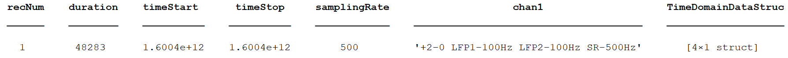
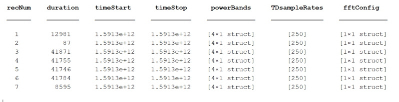
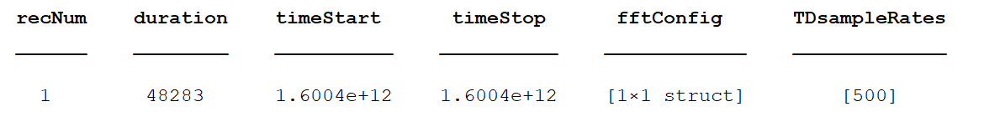
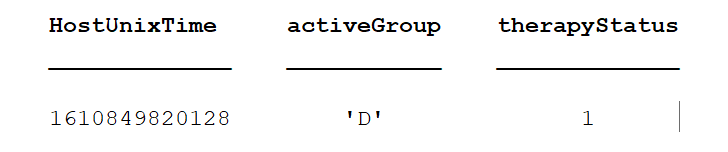

# Analysis-rcs-data
Selection of Matlab functions to extract .json raw data from Summit RC+S device, transform it to .mat format and manipulate it for initial stages of data analysis. More detail of processing flow below. 

**Background**: UCSF teams are working with Summit RC+S (RCS) devices for adaptive neurostimulation and need a validated data analysis framework to further the research. 

**Aim**: To consolidate a set of matlab functions for accessing RCS data from .json files and transforming it into data formats that enables further data analyses.

**Collaborators**: Simon.Little@ucsf.edu, Prasad.Shirvalkar@ucsf.edu, Roee.Gilron@ucsf.edu, Kristin.Sellers@ucsf.edu, Juan.AnsoRomeo@ucsf.edu, Kenneth.Louie@ucsf.edu (open for more colleagues to join...)

**Policy**: Master will contain functions that have been tested in branch and pushed after pull request reviewers have approved. The collaborator doing the initial development and testing of a function in a testing branch (e.g. in 'importRawData') will make a pull request and assign 1-2 reviewers of the group who will review the code structure and the output of each function.

## Table of Contents
- [Installation Instructions](#installation-instructions)
- [Usage](#usage)
- [Structure of Repository:](#structure-of-repository)
- [What is the RC+S native data format?](#what-is-the-rcs-native-data-format)
- [Data parsing overview](#data-parsing-overview)
- [RC+S raw data structures](#rcs-raw-data-structures)
    + [Data in .json files](#data-in-json-files)
    + [Data imported into Matlab](#data-imported-into-matlab)
- [Functions](#functions)
    + [Wrappers](#wrappers)
    + [CreateTables](#createtables)
    + [Utility](#utility)
    + [(Pre)Processing](#preprocessing)
- [How to get a time value for each sample of data](#how-to-get-a-time-value-for-each-sample-of-data)
- [`SystemTick` and `Timestamp`](#systemtick-and-timestamp)
- [How to calculate `DerivedTime`](#how-to-calculate-derivedtime)
- [Harmonization of `DerivedTime` across data streams](#harmonization-of-derivedtime-across-data-streams)
- [Factors Impacting Packet Loss](#factors-impacting-packet-loss)
    + [CTM Mode](#ctm-mode)
    + [CTM Ratio](#ctm-ratio)
    + [Other Factors which impact streaming performance:](#other-factors-which-impact-streaming-performance)
- [Overview of Adaptive Stimulation](#overview-of-adaptive-stimulation)


## Installation Instructions:
- Compatibility - Mac or PC. We rely on a toolbox to open .json files which does not work on Linux. Requires **Matlab R2019a or prior**. The toolbox we rely on to open .json files is not compatible with Matlab R2019b
- Clone this repository and add to Matlab path. 

## Usage
```[combinedDataTable, debugTable, timeDomainSettings, powerSettings, fftSettings, eventLogTable, metaData, stimSettingsOut, stimMetaData, stimLogSettings, DetectorSettings, AdaptiveStimSettings, AdaptiveRuns_StimSettings] = DEMO_ProcessRCS(pathName, processFlag)```

Optional input argument(s):<br/>
- pathName: Full path to RC+S Device folder, containing raw JSON files<br/>
- processFlag: Flag indicating if data should be saved (or read if already created):
  - 1: Process and save (overwrite if processed file already exist) -- DEFAULT
  - 2: Process and do not save
  - 3: If processed file already exists, then load. If it does not
       exist, process and save
  - 4: If processed file already exists, then load. If it does not
       exist, process but do not save<br/>

If applicable, data are saved in the same 'Device' directory where raw JSON were selected

Currently, time domain data are REQUIRED for processing to work. Other time series data streams are optional.

## Structure of Repository
- **code**
  - functions: code for specific needs; [TBD if these are further organized in subfolders]
  - toolboxes: turtle_son, etc...
- **documentationFigures**
- **testDataSets**: benchtop generated test data sets for validation of code; often generated signals are simultaneously recorded with DAQ to allow for verification of timing across data streams. 

## What is the RC+S native data format?
The Medtronic API saves data into a session directory. There are 11 .json files which are created for each session, which contain both meta-data and numerical data. Out of the box, the size/duration of these files is limited by the battery powering the CTM. Unmodified, this battery lasts for 4-5 hours. The CTM can be modified to be powered with an external battery, leading to recording duration being limited by the INS (implanted neurostimulator) battery. The INS battery can stream for up to ~30 hours. 

There are multiple challenges associated with these .json files and analyzing them: Interpreting metadata within and across the files, handling invalid / missing / misordered packets, creating a timestamp value for each sample, aligning timestamps (and samples) across data streams, and parsing the data streams when there was a change in recording or stimulation parameters. See below for the current approach for how to tackle these challenges.

## Data parsing overview

To facilitate most standard analyses of time-series data, we would optimally like the data formatted in a matrix with samples in rows, data features in columns, and a timestamp assigned to each row. The difference in time between the rows is either 1/Fs or 1/Fs\*x, where x is any whole number multiple. (In the latter case, missing values could be filled with NaNs, if desired). There are many challenges in transforming RC+S data into such a matrix. Here, we provide an overview of the overall approach. More detailed information on specific steps can be found below.


## RC+S raw data structures
Each of the .json files has packets which were streamed from the RC+S using a UDP protocol. This means that some packets may have been lost in transmission (e.g. if patient walks out of range) and/or they may be received out of order. Each of the packets contains a variable number of samples. There are metadata associated with the last sample of the packet. Below is a non-comprehensive guide regarding the main datatypes that exists within each .json file and their organization when imported into Matlab table format. In the Matlab tables, samples are in rows and data features are in columns. Note: much of the original metadata contained in the .json files is not human readable -- sample rates are stored in binary format or coded values that must be converted to Hz. Where applicable, we have completed such conversions and the human-readable values are reflected in Matlab tables.


### Data in .json files
- **RawDataTD.json**: Contains continuous raw time domain data in packet form. Each packet has timing information (and packet sizes are not consistent). Data can be streamed from up to 4 time domain channels (2 on each bore; bore = connector in INS for one physical depth/strip, which has multiple contacts) at 250Hz and 500Hz or up to 2 time domain channels at 1000Hz. Bridging can be used to record all 4 time domain channels from one bore (this version of acquisition is untested in this code repo). A `timestamp` and `systemTick` are only available for the last element of each data packet and timing information for each sample must be deduced. [See section below on timestamp and systemTick](https://github.com/openmind-consortium/Analysis-rcs-data/tree/DocumentationUpdate#systemtick-and-timestamp)
- **RawDataAccel.json**: Contains continuous raw onboard 3-axis accelerometry data as well as timing information. The structure and timing information is similar to the time domain files.
- **DeviceSettings.json**: Contains information about which datastreams were enabled, start and stop times of streaming, stimulation settings, adaptive settings, and device parameters (e.g. sampling rate, montage configuration [which electrodes are being recorded from], power bands limits, etc). Many of these settings can be changed within a given recording; each time such a change is made, another record is written to DeviceSettings.json file. 
- **RawDataFFT.json** - Contains continuous information streamed from the onboard (on-chip) FFT engine. The structure and timing information is similar to the time domain files.
- **RawDataPower.json** - Contains continuous information streamed from the on board FFT engine in select power bands. The data rate is set by the FFT engine, and can be very fast (1ms) and very slow (upper limit is in the hours or days range). This is the raw input in the onboard embedded adaptive detector. The raw power is much less data intensive than the FFT data. You can stream up to 8 power domain channels (2/each TD channel) simultaneously. Note that the actual bandpass limits are not contained in RawDataPower.json but rather in DeviceSettings.json. If these values are changed during a recording, mapping will be required from the times in DeviceSettings to the data in RawDataPower.
- **AdaptiveLog.json** - Contains any information from the embedded adaptive detector. The structure and timing information is similar to the time domain files.
- **StimLog.json** - Contains information about the stimulation setup (e.g. which group, program, rate and amplitude the device is currently using for stimulation). The structure and timing information is similar to the time domain files. Much of this information is duplicated in DeviceSettings.json and it is preferable to extract this information from DeviceSettings.json, as it tends to be more complete.
- **ErrorLog.json**- Contains information about errors. Not currently used.
- **EventLog.json** - Contains discrete annotations of user Events that can be segregated as 'EventType' and 'EventSubtype'. These can be experimental timings or patient report if streaming at home. Note that this information only contains timing information in computer time, whereas all other .json files have timing relative to (on-board) INS time. When used in its entirety, the processing pipeline transforms the times to a common time so they are comparable [See section below on timestamp and systemTick](https://github.com/openmind-consortium/Analysis-rcs-data/tree/DocumentationUpdate#systemtick-and-timestamp)
- **DiagnosticsLog.json** - Contains discrete information that can be used for error checking.
- **TimeSync.json**: Not currently used

Note that in each recording session, all .json files will be created and saved. If a particular datastream (e.g. FFT) is not enabled to stream, that .json file will be mostly empty, containing only minimal metadata.

### Data imported into Matlab 

- **RawDataTD.json** --> timeDomainData:
  - `DerivedTime`: Computed time for each sample. [See How to Calculate DerivedTime for more information](https://github.com/openmind-consortium/Analysis-rcs-data/blob/DocumentationUpdate/README.md#how-to-calculate-derivedtime)
  - `timestamp`: INS clock driven timer that does not roll over. Highest resolution is 1 second. Total elaped time since March 1, 2000 at midnight. One value per packet, corresponding to last sample in the packet. [See section below on timestamp and systemTick](https://github.com/openmind-consortium/Analysis-rcs-data/tree/DocumentationUpdate#systemtick-and-timestamp)
  - `systemTick`: 16-bit INS clock timer that rolls over every 2^16 values. Highest resolution is 100 microseconds. One value per packet, corresponding to last sample in the packet. [See section below on timestamp and systemTick](https://github.com/openmind-consortium/Analysis-rcs-data/tree/DocumentationUpdate#systemtick-and-timestamp)
  - `PacketGenTime`: API estimate of when the packet was created on the INS within the PC clock domain. Estimate created by using results of latest latency check (one is done at system initialization, but can re-perform whenever you want) and time sync streaming. Only accurate within ~50ms.
  - `PacketRxUnixTime`: PC clock-driven time when the packet was received. Highly inaccurate after packet drops.
  - `dataTypeSequence`: 8-bit packet number counter that rolls over, ranging from 0 to 255; can be used to help identify if packets are in order or are missing. Should run continuously, but instances of resetting have been observed.
  - `samplerate`: Fs in Hz; only written in rows corresponding to last sample of each packet.
  - `packetsizes`: Number of samples per packet. Written in rows corresponding to the last sample of each packet.
  - `key0`: Channel 0; contains numerical data in millivolts
  - `key1`: Channel 1; contains numerical data in millivolts
  - `key2`: Channel 2; contains numerical data in millivolts
  - `key3`: Channel 3; contains numerical data in millivolts
   
- **RawDataAccel.json** --> AccelData:
  - `DerivedTime`
  - `timestamp`
  - `systemTick`
  - `PacketGenTime`
  - `PacketRxUnixTime`
  - `dataTypeSequence`
  - `samplerate`
  - `packetsizes`
  - `XSamples`: X-axis
  - `YSamples`: Y-axis
  - `ZSamples`: Z-axis

- **RawDataPower.json** --> PowerData
  - `DerivedTime`
  - `timestamp`
  - `systemTick`
  - `PacketGenTime`
  - `PacketRxUnixTime`
  - `dataTypeSequence`
  - `samplerate`
  - `packetsizes`  
  - `dataSize`
  - `dataType`
  - `globalSequence`
  - `info`
  - `TDsamplerate`
  - `ExternalValueMask`
  - `FftSize`
  - `IsPowerChannelOverrange`
  - `ValidDataMask`
  - `Band1`
  - `Band2`
  - `Band3`
  - `Band4`
  - `Band5`
  - `Band6`
  - `Band7`
  - `Band8`

- **RawDataFFT.json** --> FFTData
  - `DerivedTime`
  - `timestamp`
  - `systemTick`
  - `PacketGenTime`
  - `PacketRxUnixTime`
  - `dataTypeSequence`
  - `samplerate`
  - `packetsizes` 
  - `Channel`
  - `FftSize`
  - `FftOutput`
  - `Units`
  - `TDsamplerate`
  - `dataSize`
  - `dataType`
  - `globalSequence`
  - `info`
  - `user1`
  - `user2`
    
- **AdaptiveLog.json** --> AdaptiveData
  - `DerivedTime`
  - `timestamp`
  - `systemTick`
  - `PacketGenTime`
  - `PacketRxUnixTime`
  - `dataTypeSequence`
  - `samplerate`
  - `packetsizes`  
  - `CurrentAdaptiveState`
  - `CurrentProgramAmplitudesInMilliamps`
  - `IsInHoldOffOnStartup`
  - `Ld0DetectionStatus`
  - `Ld1DetectionStatus`
  - `PreviousAdaptiveState`
  - `SensingStatus`
  - `StateEntryCount`
  - `StateTime`
  - `StimFlags`
  - `StimRateInHz`
  - `dataSize`
  - `dataType`
  - `info`
  - `Ld0_featureInputs`
  - `Ld0_fixedDecimalPoint`
  - `Ld0_highThreshold`
  - `Ld0_lowThreshold`
  - `Ld0_output`
  - `Ld1_featureInputs`
  - `Ld1_fixedDecimalPoint`
  - `Ld1_highThreshold`
  - `Ld1_lowThreshold`
  - `Ld1_output`
  
- **StimLog.json** --> stimLogSettings 
  - `HostUnixTime`
  - `activeGroup`
  - `therapyStatus`
  - `GroupA`: Contains settings for stimulation group A (`RateInHz`, `ampInMilliamps`, `pulseWidthInMicroseconds`)
  - `GroupB`: Contains settings for stimulation group B (`RateInHz`, `ampInMilliamps`, `pulseWidthInMicroseconds`)
  - `GroupC`: Contains settings for stimulation group C (`RateInHz`, `ampInMilliamps`, `pulseWidthInMicroseconds`)
  - `GroupD`: Contains settings for stimulation group D (`RateInHz`, `ampInMilliamps`, `pulseWidthInMicroseconds`)
  - `updatedParameters`: Which variable(s) were updated from the prior entry in stimLogSettings

- **EventLog.json** --> eventLogTable
  - `SessionId`
  - `HostUnixTime`
  - `EventName`
  - `EventType`
  - `EventSubType`
  - `UnixOnsetTime`
  - `UnixOffsetTime'

- **DeviceSettings.json** 
[examples from different files]
  - `timeDomainSettings`
  
    
  
  - `powerSettings`
  
    
  
  - `fftSettings`
    
  
  - `stimSettingsOut'
    
  
  - `stimMetaData'
    - `validPrograms`
    - `validProgramNames`
    - `anodes`
    - `cathodes`
  
  - `metaData`
    - `subjectID`
    - `patientGender`
    - `handedness`
    - `implantedLeads`
    - `extensions`
    - `leadLocations`
    - `leadTargets`
    - `INSimplantLocation`
    - `stimProgramNames`
    - `UTCoffset`
    - `batteryLevelPercent`
    - `batteryVoltage`
    - `estimatedCapacity`
    - `batterySOC`

  - `DetectorSettings` [Adaptive]
    - `HostUnixTime`
    - `Ld0`: contains fields `biasTerm`, `blankingDurationUponStateChange`, `detectionEnable`, `detectionInputs`, `features`, `fractionalFixedPointValue`, `holdoffTime`, `onsetDuration`, `terminationDuration`, `updateRate`
    - `Ld1`: contains fields `biasTerm`, `blankingDurationUponStateChange`, `detectionEnable`, `detectionInputs`, `features`, `fractionalFixedPointValue`, `holdoffTime`, `onsetDuration`, `terminationDuration`, `updateRate`
    - `DetectorStatus`
    - `updatedParameters`
  
  - `AdaptiveStimSettings` [Table with all changes to adaptive settings]
    - `HostUnixTime`
    - `deltas`: contains fields for rise and fall rates, in mA/sec, for each of the four possible bands
    - `states`: contains fields for state0-state8 indicating if that state is valid and ampInMilliamps; NaN indicates stimulation is not defined; -1 indicates hold for that state
    - `stimRate`: In Hz
    - `adaptiveMode`: 0 = disabled; 1 = operative; 2 = embedded
    - `adaptiveStatus`: 0 = disabled; 1 = operative; 2 = embedded
    - `currentState`
    - `deltaLimitsValid`
    - `deltasValid`
    - `updatedParameters`
  
  - `AdaptiveRuns_StimSettings` [Table with only changes to adaptive settings when adaptive was on, or transitioning from off [0] to embedded [2]]
    - `HostUnixTime`
    - `deltas`: contains fields for rise and fall rates, in mA/sec, for each of the four possible bands
    - `states`: contains fields for state0-state8 indicating if that state is valid and ampInMilliamps; NaN indicates stimulation is not defined; -1 indicates hold for that state
    - `stimRate`: In Hz
    - `adaptiveMode`: 0 = disabled; 1 = operative; 2 = embedded
    - `adaptiveStatus`: 0 = disabled; 1 = operative; 2 = embedded
    - `currentState`
    - `deltaLimitsValid`
    - `deltasValid`  

- **ErrorLog.json**: Not currently used
- **DiagnosticsLog.json**: Not currently used
- **TimeSync.json**: Not currently used

## Functions
This list contains the functions that have been tested in branch and pushed to master (brief description of function input output next to each function name)

### Wrappers
- **DEMO_ProcessRCS**: Demo wrapper script for importing raw .JSON files from RC+S, parsing into Matlab table format, and handling missing packets / harmonizing timestamps across data streams

### CreateTables
- **createAccelTable**: Create Matlab table of raw data from RawDataAccel.json
- **createAdaptiveSettingsfromDeviceSettings**: Create Matlab table of adaptive settings from DeviceSettings.json
- **createAdaptiveTable**: Create Matlab table of adaptive time domain signals from AdaptiveLog.json
- **createCombinedTable**: Create Matlab table of combined data, with harmonized `DerivedTime`values
- **createDataTableWithMultipleSamplingRates**: Create Matlab table from data with multiple sampling rates within a data stream
- **createDeviceSettingsTable**: Extract information from DeviceSettings.json related to configuration for time domain, power domain, FFT domain, adaptive, and stimulation
- **createEventLogTable**: Extract information from EventLog.json 
- **createFFTtable**: Create Matlab table of raw data from RawDataFFT.json
- **createPowerTable**: Create Matlab table of raw data from RawDataPower.json
- **createStimSettingsFromDeviceSettings**: Create Matlab table of stim settings data from DeviceSettings.json
- **createStimSettingsTable**: Create Matlab table of stim data from StimLog.json
- **createTimeDomainTable**: Create Matlab table of raw data from RawDataTD.json

### Utility
- **addNewEntry_FFTSettings**: Extract FFT settings in order to add a new row to the `FFT_SettingsTable`
- **addNewEntry_PowerDomainSettings**: Extract powerDomain settings in order to collect data to add a new row to the `Power_SettingsTable`
- **addNewEntry_StimSettings**: Collect data to add a new row to the `Stim_SettingsTable`
- **addNewEntry_TimeDomainSettings**: Extract timeDomain settings in order to add a new row to the `TD_SettingsTable`
- **addRowToTable**: Add row of new data to table
- **calculateDeltaSystemTick**: A 'circular calculator' for `systemTick`, to determine total elapsed time (assuming no full rollover of `systemTick`)
- **convertMetadataCodes**: Convert Medtronic numeric codes from the subjectInfo field of DeviceSettings to human readable information
- **convertTDcodes**: Conversion of Medtronic numeric codes into values (e.g. Hz)
- **deserializeJSON**: Reads .json files and loads into Matlab
- **fixMalfomedJSON**: Checks for and replaces missing brackets and braces in json file, which can prevent proper loading
- **getFFTparameters**: Determine FFT parameters from FFTconfig and TD sample rate
- **getPowerBands**: Calculate lower and upper bounds, in Hz, for each power domain timeseries
- **getSampleRate**: Convert Medtronic codes to sample rates in Hz for time domain data
- **getSampleRateAcc**: Convert Medtronic codes to sample rates in Hz for accelerometer data
- **getStimParameters**: For a given stimulation group, update prior fields with any information present in current fields

### (Pre)Processing
- **assignTime**: Function for creating timestamps for each sample of valid RC+S data. 
- **harmonizeTimeAcrossDataStreams**: Shift `DerivedTime` values to nearest `unifiedDerivedTimes` value, extending `unifiedDerivedTimes` as needed

## How to get a time value for each sample of data
Ideally, there would be a value reported with each packet from which we could easily re-create unix time for each sample. Nominally, this would be `PacketGenTime`. However, upon inspection we see that: 
- **(1)** The difference between adjacent `PacketGenTime` values does not always equal the expect amount of elapsed time, where the expected amount of elapsed time is calculated by the number of samples in the packet and the sampling rate. This is a serious problem. In cases where there is missing time, we would lose the stereotyped 1/Fs duration between samples. In cases of overlap, how do we account for having more than one value sampled at the same time?
- **(2)** `PacketGenTime` has suspect values across packets and relative to other timing variables. Together, these indicate that `PacketGenTime` is unreliable when high precision time reconstruction is required (as for some task-locked analyses, looking at ERPs, etc).

Drift between `timestamp` and `PacketGenTime` across a long recording (9.3 hours):


Given that `PacketGenTime` does not provide a complete solution, we next looked at `systemTick` and `timestamp`.

## `SystemTick` and `Timestamp`

Each packet has one value for each of the following, corresponding to the last sample in the packet: `systemTick`, `timestamp`, and `packetGenTime`. Theoretically, `systemTick` and `timestamp` can be used to recreate the time of each packet, and then we can depend upon one value of `PacketGenTime` in order to convert to unix time. However, we have observed from empirical data (both recorded in a patient and using a benchtop test system) that the clocks of `systemTick` and `timestamp` accumulate error relative to each other during long recordings (e.g. 10 hours). Using `systemTick` and `timestamp` to recreate time may be an acceptable solution for short recordings, but because long recordings are often conducted, we have chosen to move away from this implementation. 

Stated a different way, for each unit of `timestamp` (1 second), we would expect 10,000 units of `systemTick`. However, this is not what we observe.

Evidence of accumulating drift between `systemTick` and `timestamp`:

In a given recording, we observed the following pairs of `systemTick` and `timestamp` near the beginning of the recording:

| systemTick | timestamp |
| ---------- | --------- |
| 19428	| 641771410 | 
| 20417	| 641771411 |
| 21393	| 641771411 |
| 22393	| 641771411 |
| 23408	| 641771411 |
| 24408	| 641771411 |
| 25408	| 641771411 |
| 26398	| 641771411 |
| 27408	| 641771411 |
| 28411	| 641771411 |
| 29398	| 641771411 |
| 30411	| 641771412 |

And in the same recording, we observed these pairs of `systemTick` and `timestamp` near the end of the recording:

| systemTick | timestamp |
| ---------- | --------- |
| 17358 |	641805097 |
| 18353 |	641805098 |
| 19368 |	641805098 |
| 20371 |	641805098 |
| 21368 |	641805098 |
| 22358 |	641805098 |
| 23368 |	641805098 |
| 24371 |	641805098 |
| 25358 |	641805098 |
| 26371 |	641805098 |
| 27368 |	641805098 |
| 28361 |	641805099 |

Between these `timestamps`, 33687 seconds have elapsed. That means we would expect (33687 * 10000) `systemTicks` to have elapsed. Accounting for rollover every 2^16 `systemTicks`, that would put us at expecting `systemTicks` between 35377 and 44358 to be paired with `timestamp` 641805098.  

As you can see – this is a multiple second discrepancy – we should be in the `systemTick` range of 35377 to 44358 but rather we are in the range of 18353 to 27368.

Because of this accumulated error, we instead take a different approach for how to calculate `DerivedTime`

## How to calculate `DerivedTime`

Because of the above described unreliability of `PacketGenTime` and the offset in the clocks creating `timestamp` and `systemTick`, we take a different approach for calculating `DerivedTime`. `DerivedTime` refers to a new time stamp, in unix time, assigned to each sample. `DerivedTime` is calculated after removing packets which have faulty information (e.g. `PacketGenTime` is negative). This is our best estimation of when these samples were recorded. The processing steps described below are implemented in `assignTime.m`. Note -- the implementation of this approach relies on the assumption that only full packets of data are missing, but there are no individual samples missing between packets (this has been shown to be the case through elegant work at Brown University). We do depend on `PacketGenTime` in order to convert to unix time, but we only use one `PacketGenTime` value per chunk of data (rather than using `PacketGenTime` to align each packet of data).


- Identify and remove packets with faulty meta-data or which indicate samples will be hard to place in continuous stream (e.g. packets with `timestamp` that is more than 24 hours away from median `timestamp`; packets with negative `PacketGenTime`; packets with outlier `packetGenTimes`; packets where `packetGenTime` goes backwards in time)
- Chunk data -- chunks are defined as segments of data which were continuously sampled. Breaks between chunks can occur because packets were removed in the previous step, because there were dropped packets (never acquired), or because streaming was stopped but the recording was continued. Changes in time domain sampling rate will also result in a new chunk. Chunks are identified by looking at the adjacent values of `dataTypeSequence`, `timestamp` and `systemTick` as a function of sampling rate and number of samples per packet.
- We need to align each chunk to a time:
  - For the first chunk in a file, we align using the `PacketGenTime` of the first packet in the chunk.
  - In cases where the gap between chunks of data is < 6 seconds (as determined by comparing `timestamp` values), we can align by using adjacent `systemTick` values (`systemTick` from the last packet of the previous chunk and `systemTick` of the first packet of the next chunk). This is possible because we have stayed within one full cycle of `systemTick` values.
  - In cases where the gap between chunks of data is >= 6 seconds, we look across all the packets in the chunk and calculate the average offset between each `packetGenTime` and the amount of time that is expected to have elapsed (calculated based on sampling rate and number of samples in the packet). We then apply this offset to the `packetGenTime` corresponding to the first packet of the chunk. We can now calculate a time for each sample in the chunk, as a function of the sampling rate. 
- The above process is repeated separately for each chunk.

`DerivedTime` are created separately for each data stream (e.g. TimeDomain, Accelerometer, PowerDomain), as each of these streams have `systemTick` and `timestamp` values reported per packet. Harmonization of `derivedTime` across data streams happens next.

## Harmonization of `DerivedTime` across data streams

After creating `DerivedTime` separately for each time series data stream, we must 'harmonize' these times across data streams. `DerivedTime` for the time domain data are taken as the `unifiedDerivedTime`, or the common time base. For each other time series (e.g. accelerometer, power, FFT, adaptive), each `DerivedTime` is shifted to the nearest `unifiedDerivedTime`. In some cases, non-time domain data streams may extend before or after time domain data -- in these instances, we add values to `unifiedDerivedTime` in steps of 1/Fs (time domain Fs) to accomodate all times. 


Lastly, all the time series data streams are combined into one table, `combinedDataTable`. Whenever a data stream lacks a value for a particular `unifiedDerivedTime` value (called `DerivedTime` again), that entry in the table is filled with a NaN. The table does not contain any columns which are entirely filled with NaNs.

Possible sample rates (in Hz):
- **Time domain**: 250, 500, 1000
- **Accelerometer**: 4.069, 8.138, 16.276, 32.552, 65.104
- **Power Domain**: 0.1 - 20
- **FFT**: 0.1 - 20

## Factors Impacting Packet Loss

A number of factors impact the fidelity with which the RC+S streams data to the host computer. Several RC+S streaming parameters can be configured depending on the use case:

### CTM Mode
- The RC+S CTM can operate in two different modes, Mode 3 or Mode 4
  - Mode 3: Optimal for streaming data across longer distances at a slower rate
  - Mode 4: Optimal for streaming data across shorter distances at a faster rate

### CTM Ratio
- This is a ratio between [the number of packets sent by the INS to the host computer] vs [the number of packets sent by the host computer to the INS]
- In general, high CTM ratios should be used for high-throughput sensing applications; low CTM ratios should be used when the INS parameters must be updated rapidly (as would be the case during distributed DBS)

### Other Factors which impact streaming performance:
- Distances between the host computer, CTM, and INS
- 60/50 Hz environmental noise
- Number of channels being streamed
- Sampling frequency

## Overview of Adaptive Stimulation
The RC+S system is designed to deliver Adaptive Stimulation based on neural biomarker(s) band(s) fluctuations. The device has 2 detectors (Ld0 and Ld1) and the adaptive therapy can be set based on one or the combination of both detectors. Each detector can be configured with one up to four power bands (input features). A detector state is defined as a function of the detector output signal relative to a predefined threshold (single or dual treshold). In the case of dual theshold, the detector output may transition among 3 states, 'below' lower threshold, 'in between' lower and upper threshold, and 'above' upper threshold; in the case of a single threshold, the detector output fluctuates between 2 states ('below' and 'above' threshold). Each Therapy Status State is mapped to 1 of 9 possible states, depending on whether one or two detectors are used and whether single or dual threshold is used for each detector.

The two main functions of the code base specific to the adaptive therapy engine are (see CreateTables section above):
1) createAdaptiveSettingsfromDeviceSettings
2) createAdpativeData

From the first table we get the adaptive metadata and adaptive settings which can be changed by the user, eg. one recording session containing a series of detector and adaptive settings changes. From the second table we get the adaptive detector time series data.

createAdaptiveSettingsfromDeviceSettings gives the following outputs
- DetectorSettings: contains any changes in the detectors settings
- AdaptiveStimSettings: contains any changes in adpative settings (metadata, deltas, states).
- AdaptiveRuns_StimSettings: contains Adaptive Settings for each new Adaptive run  

 As with the other data streams, the output adaptive time series are harmonized with the rest of data streams using harmonizeTimeAcrossDataStreams (using unifiedDerivedTimes and srates_TD).
