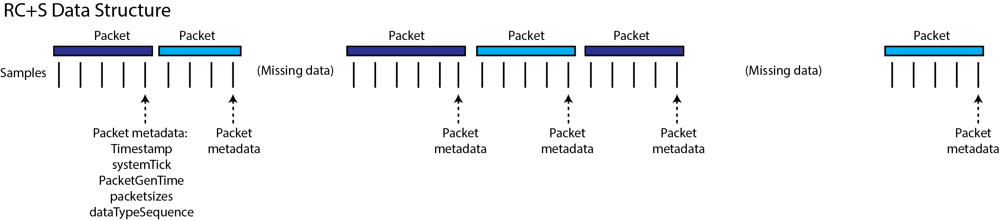
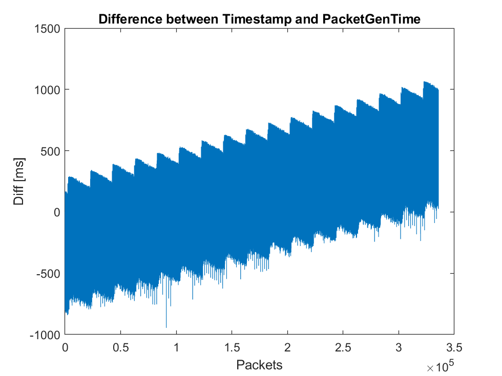
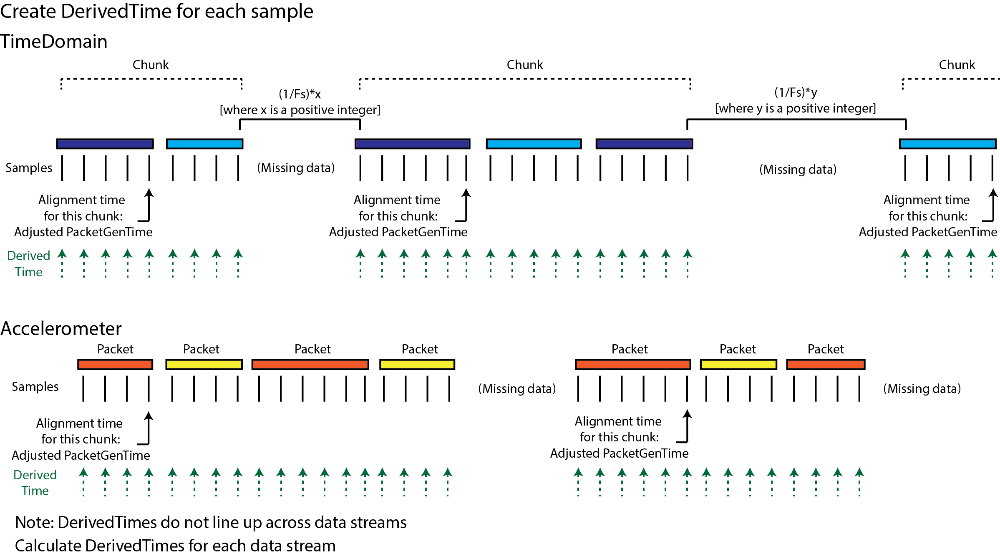
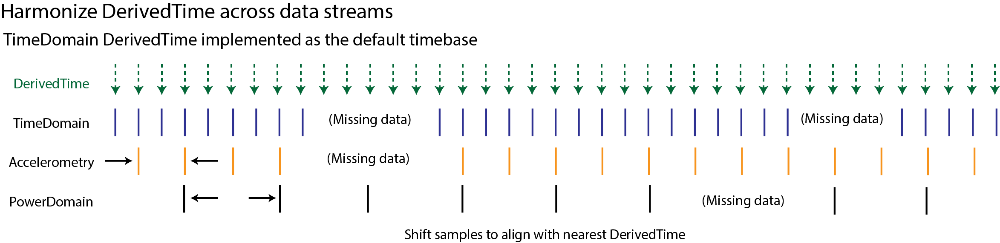

# Analysis-rcs-data
Matlab functions and scripts to facilitate raw data extraction and subsequent visualizations and computations on data from Summit RC+S device. Initial processing includes extraction of .json raw data, transformation to .mat format, and combining multiple data streams and meta-data sources. This repo also contains plotting functionality which relies on this combined data structure, and additional processing modules (e.g. calculate power domain data from time domain). 

**Background**: UCSF teams are working with Summit RC+S (RCS) devices for adaptive neurostimulation and need a validated data analysis framework to further the research. 

**Aim**: To consolidate a set of matlab functions and scripts for accessing RCS data from .json files, transform it to a data format that enables further data analyses, and provide plotting and visualization tools.

**Collaborators**: Roee.Gilron@ucsf.edu, Kristin.Sellers@ucsf.edu, Juan.AnsoRomeo@ucsf.edu, Kenneth.Louie@ucsf.edu, Simon.Little@ucsf.edu, Prasad.Shirvalkar@ucsf.edu (open for more colleagues to join...)

**Policy**: Master will contain functions that have been tested in branch and pushed after pull request reviewers have approved. The collaborator doing the initial development and testing of a function in a testing branch (e.g. in 'importRawData') will make a pull request and assign 1-2 reviewers of the group who will review the code structure and the output of each function.

## Table of Contents
- [Installation Instructions](#installation-instructions)
- [Structure of Repository](#structure-of-repository)
- [Overview of tools provided in this repo](#overview-of-tools-provided-in-this-repo)
- [Usage](#usage)
- [What is the RC+S native data format?](#what-is-the-rcs-native-data-format)
- [RC+S raw data structures](#rcs-raw-data-structures)
    + [JSON data files](#json-data-files)
- [Data parsing overview](#data-parsing-overview)       
- [Data tables contained in AllDatatables.mat output file](#data-tables-contained-in-alldatatablesmat-output-file)
- [Creating combined data table](#creating-combineddatatable)
- [How to get a time value for each sample of data](#how-to-get-a-time-value-for-each-sample-of-data)
- [`SystemTick` and `Timestamp`](#systemtick-and-timestamp)
- [How to calculate `DerivedTime`](#how-to-calculate-derivedtime)
- [Harmonization of `DerivedTime` across data streams](#harmonization-of-derivedtime-across-data-streams)
- [Factors Impacting Packet Loss](#factors-impacting-packet-loss)
    + [CTM Mode](#ctm-mode)
    + [CTM Ratio](#ctm-ratio)
    + [Other Factors which impact streaming performance:](#other-factors-which-impact-streaming-performance)
- [Overview of Adaptive Stimulation](#overview-of-adaptive-stimulation)

## Installation Instructions:
- Compatibility - Mac or PC (Linux test pending). We rely on a toolbox (https://github.com/JimHokanson/turtle_json) to open .json files - many thanks to Jim Hokanson for additional development, now permitting functionality with all versions of Matlab.
- Clone this repository and add to Matlab path. 

## Structure of Repository
- **code**
  - functions: code for specific needs
  - toolboxes: turtle_json, etc...
- **documentationFigures**
- **testDataSets**: benchtop generated test data sets for validation of code; often generated signals are simultaneously recorded with DAQ to allow for verification of timing across data streams. 

## Overview of tools provided in this repo

- **Part 1 - ProcessRCS:** Function for importing raw .JSON files from RC+S, parsing into Matlab table format, and handling missing packets / harmonizing timestamps across data streams
- **Part 2 - DEMO_LoadRCS**: Demo script for loading `AllDataTables.mat` (saved output from `ProcessRCS`) and creating `combinedDataTable`<br>
**DEMO_LoadDebugTable:** Demo script for loading `AllDataTables.mat` (saved output from `ProcessRCS`), converting sparse matrics into tables, and creating `debugTable`
- **Part 3 - rcsPlotter**
- **Part 4 - Analysis functions** which rely on the data structure output from (Part 1) and (Part 2)
    - e.g. `getPowerfromTimeDomain`

## Usage
**Part 1**

```[unifiedDerivedTimes, timeDomainData, timeDomainData_onlyTimeVariables, timeDomain_timeVariableNames, AccelData, AccelData_onlyTimeVariables, Accel_timeVariableNames,  PowerData, PowerData_onlyTimeVariables, Power_timeVariableNames, FFTData, FFTData_onlyTimeVariables, FFT_timeVariableNames, AdaptiveData, AdaptiveData_onlyTimeVariables, Adaptive_timeVariableNames, timeDomainSettings, powerSettings, fftSettings, eventLogTable, metaData, stimSettingsOut, stimMetaData, stimLogSettings, DetectorSettings, AdaptiveStimSettings, AdaptiveEmbeddedRuns_StimSettings] = ProcessRCS(pathName, processFlag, shortGaps_systemTick)```

Optional input argument(s):<br/>
\[If no `pathName` is selected, a folder selection dialog box will open at the start of processing\]
- `pathName`: Full path to RC+S Device folder, containing raw JSON files<br/>
- `processFlag`: Flag indicating if data should be saved (or read if already created):
  - 1: Process and save (overwrite if processed file already exist) -- DEFAULT
  - 2: Process and do not save
  - 3: If processed file already exists, then load. If it does not
       exist, process and save
  - 4: If processed file already exists, then load. If it does not
       exist, process but do not save<br/>
- `shortGaps_systemTick`: For advanced users: Flag, default is '0', indicating that `PacketGenTime` should be used to align the start of all chunks regardless of preceeding gap length; setting to '1' indicates that `systemTick` should be used for time alignment of chunks if preceeding gap is < 6 seconds

If applicable, data are saved in the same 'Device' directory where raw JSON were selected

**Part 2**

With the output of ProcessRCS still loaded into the workspace (or after loading AllDataTables.mat, the output of ProcessRCS) - can create combinedDataTable with the selected data streams:

```dataStreams = {timeDomainData, AccelData, PowerData, FFTData, AdaptiveData};```

```[combinedDataTable] = createCombinedTable(dataStreams,unifiedDerivedTimes,metaData);```

Currently, time domain data are REQUIRED for processing to work. Other time series data streams are optional.

See example scripts DEMO_LoadRCS.m and DEMO_LoadDebugTable.m

**Part 3**

Plotting helper for RC+S files<br/>
   
Background: 
  
This class is built as as a utility function to make plotting RC+S data easier. It wraps other functions in this repo and handles loading multiple folders and plotting specific data streams such as time domain, acitgraphy, power bands, adaptive etc. Note that the `signal processing toolbox` is needed for some functions to work properly.
 
There are 2 main "type" of methods in this function:<br/>

- 1: "plotXX" methods: will help plot specific streams 
- 2: "reportXX" methods: report some aspect of the data 
  
  
Usage / Philosophy:<br/>
  
This function creats an object of type "rcsPlotter" with several associated methods. Each type of data stream can be plotted without arguments in a new figure. However, the main utilty of the function is in stringing together several folders of RC+S data (for example recorded throughout a day) and easily plotting requested data streams (such as time domain, power and adaptive) in subplots. This is acheived by passing the subplot hanlde to the function.<br/>
        
 Some usage examples: 
 
- 1: Plot time domain data: 

```
               rc = rcsPlotter()
               rc.addFolder('path to rc+s folder'); 
               rc.loadData()
               rc.plotTdChannel(1)
```  
   
- 2: Plot 2 time domain channels, 1 actigraphy channel 

```
               rc = rcsPlotter()
               rc.addFolder('\some\path\to\rcs-folder\with\raw\jsons\'); 
               rc.loadData()
               
               % create figure
               hfig = figure('Color','w');
               hsb = gobjects();
               nplots = 3; 
               for i = 1:nplots; hsb(i,1) = subplot(nplots,1,i); end;
               rc.plotTdChannel(1,hsb(1,1));
               rc.plotTdChannel(2,hsb(2,1));
               rc.plotActigraphyChannel('X',hsb(3,1));
               % link axes since time domain and others streams have diff sample rates
               linkaxes(hsb,'x');
```

Using the `rc.addFolder` method multiple folders can be added and plotted. 

We have also added a convenience GUI that wraps `rcsPlotter` and allows for dynamic plotting. 

Usage: 


**Part 4**

Coming soon

## What is the RC+S native data format?
The Medtronic API saves data into a session directory. There are 11 .json files which are created for each session, which contain both meta-data and numerical data. Out of the box, the size/duration of these files is limited by the battery powering the CTM. Unmodified, this battery lasts for 4-5 hours. The CTM can be modified to be powered with an external battery, leading to recording duration being limited by the INS (implanted neurostimulator) battery. The INS battery can stream for up to ~30 hours. 

There are multiple challenges associated with these .json files and analyzing them: Interpreting metadata within and across the files, handling invalid / missing / misordered packets, creating a timestamp value for each sample, aligning timestamps (and samples) across data streams, and parsing the data streams when there was a change in recording or stimulation parameters. See below for the current approach for how to tackle these challenges.

## RC+S raw data structures
Each of the .json files has packets which were streamed from the RC+S using a UDP protocol. This means that some packets may have been lost in transmission (e.g. if patient walks out of range) and/or they may be received out of order. Each of the packets contains a variable number of samples. There are metadata associated with the last sample of the packet. Below is a non-comprehensive guide regarding the main datatypes that exists within each .json file and their organization when imported into Matlab table format. In the Matlab tables, samples are in rows and data features are in columns. Note: much of the original metadata contained in the .json files is not human readable -- sample rates are stored in binary format or coded values that must be converted to Hz. Where applicable, we have completed such conversions and the human-readable values are reflected in Matlab tables.



### JSON data files 
- **RawDataTD.json**: Contains continuous raw time domain data in packet form. Each packet has timing information (and packet sizes are not consistent). Data can be streamed from up to 4 time domain channels (2 on each bore; bore = connector in INS for one physical depth/strip, which has multiple contacts) at 250Hz and 500Hz or up to 2 time domain channels at 1000Hz. Bridging can be used to record all 4 time domain channels from one bore (this version of acquisition is untested in this code repo). A `timestamp` and `systemTick` are only available for the last element of each data packet and timing information for each sample must be deduced. [See section below on timestamp and systemTick](#systemtick-and-timestamp)
- **RawDataAccel.json**: Contains continuous raw onboard 3-axis accelerometry data as well as timing information. The structure and timing information is similar to the time domain files.
- **DeviceSettings.json**: Contains information about which datastreams were enabled, start and stop times of streaming, stimulation settings, adaptive settings, and device parameters (e.g. sampling rate, montage configuration [which electrodes are being recorded from], power bands limits, etc). Many of these settings can be changed within a given recording; each time such a change is made, another record is written to DeviceSettings.json file. 
- **RawDataFFT.json** - Contains continuous information streamed from the onboard (on-chip) FFT engine. The structure and timing information is similar to the time domain files.
- **RawDataPower.json** - Contains continuous information streamed from the on board FFT engine in select power bands. The data rate is set by the FFT engine, and can be very fast (50ms) and very slow (upper limit is in the hours or days range). This is the raw input in the onboard embedded adaptive detector. The raw power is much less data intensive than the FFT data. You can stream up to 8 power domain channels (2/each TD channel) simultaneously. Note that the actual bandpass limits are not contained in RawDataPower.json but rather in DeviceSettings.json. If these values are changed during a recording, mapping will be required from the times in DeviceSettings to the data in RawDataPower.
- **AdaptiveLog.json** - Contains any information from the embedded adaptive detector. The structure and timing information is similar to the time domain files.
- **StimLog.json** - Contains information about the stimulation setup (e.g. which group, program, rate and amplitude the device is currently using for stimulation). The structure and timing information is similar to the time domain files. Much of this information is duplicated in DeviceSettings.json and it is preferable to extract this information from DeviceSettings.json, as it tends to be more complete.
- **ErrorLog.json**- Contains information about errors. Not currently used.
- **EventLog.json** - Contains discrete annotations of user Events that can be segregated as 'EventType' and 'EventSubtype'. These can be experimental timings or patient report if streaming at home. Note that this information only contains timing information in computer time, whereas all other .json files have timing relative to (on-board) INS time. When used in its entirety, the processing pipeline transforms the times to a common time so they are comparable [See section below on timestamp and systemTick](#systemtick-and-timestamp)
- **DiagnosticsLog.json** - Contains discrete information that can be used for error checking.
- **TimeSync.json**: Not currently used

Note that in each recording session, all .json files will be created and saved. If a particular datastream (e.g. FFT) is not enabled to stream, that .json file will be mostly empty, containing only minimal metadata.

## Data parsing overview

To facilitate most standard analyses of time-series data, we would optimally like the data formatted in a matrix with samples in rows, data features in columns, and a timestamp assigned to each row. The difference in time between the rows is either 1/Fs or 1/Fs\*x, where x is any whole number multiple. (In the latter case, missing values could be filled with NaNs, if desired). There are many challenges in transforming RC+S data into such a matrix. Here, we provide an overview of the overall approach. More detailed information on specific steps can be found below.


## Data tables contained in AllDataTables.mat output file
ProcessRCS creates output files `AllDataTables.mat`. The following data tables are saved in this output file. Users may first choose to run `createCombinedTable.m` in order to create the combinedDataTable, which produces a table with DerivedTimes with steps of 1/Fs (time domain Fs), and NaNs filling entries where there are not new data samples.

- **`timeDomainData`**
  - `localTime`: DerivedTime shown in human-readable format, accounting for UTC offset
  - `DerivedTime`: Computed time for each sample. [See How to Calculate DerivedTime for more information](#how-to-calculate-derivedtime)
  - `samplerate`: Sampling rate in Hz; only written in rows corresponding to last sample of each packet.
  - `key0`: Channel 0; contains numerical data in millivolts
  - `key1`: Channel 1; contains numerical data in millivolts
  - `key2`: Channel 2; contains numerical data in millivolts
  - `key3`: Channel 3; contains numerical data in millivolts
   
- **`AccelData`**
  - `localTime`: newDerivedTime shown in human-readable format, accounting for UTC offset
  - `newDerivedTime`: DerivedTime calculated for AccelData shifted to nearest DerivedTime from timeDomainData
  - `samplerate`: Same as above
  - `XSamples`: X-axis
  - `YSamples`: Y-axis
  - `ZSamples`: Z-axis

- **`PowerData`**
  - `localTime`: newDerivedTime shown in human-readable format, accounting for UTC offset
  - `newDerivedTime`: DerivedTime calculated for PowerData shifted to nearest DerivedTime from timeDomainData
  - `samplerate`: Same as above
  - `TDsamplerate`: Sampling rate (in Hz) of time domain data
  - `IsPowerChannelOverrange`: Boolean 
  - `FftSize`: Number of points in FFT calculation
  - `ValidDataMask`: Binary string representing if data valid for each power channel (e.g. 00000011 indicates that Band1 and Band2 are valid)
  - `ExternalValuesMask`: Binary string representing if external test values are being used instead of internal power data for each power channel (e.g. 00000000 indicates that all Bands are providing internal power data)
  - `Band1`: Power values
  - `Band2`: Power values
  - `Band3`: Power values
  - `Band4`: Power values
  - `Band5`: Power values
  - `Band6`: Power values
  - `Band7`: Power values
  - `Band8`: Power values

- **`FFTData`**
  - `localTime`: newDerivedTime shown in human-readable format, accounting for UTC offset
  - `newDerivedTime`: DerivedTime calculated for FFTData shifted to nearest DerivedTime from timeDomainData
  - `samplerate`: Same as above
  - `Channel`: Byte indicating which FFT channel is being streamed, 0-3
  - `FftOutput`: The FFT output bins from the INS
  - `Units`: Units of the bins data points
  - `FftSize`: Number of points in FFT calculation
  - `TDsamplerate`: Sampling rate (in Hz) of time domain data
    
- **`AdaptiveData`**
  - `localTime`: newDerivedTime shown in human-readable format, accounting for UTC offset
  - `newDerivedTime`: DerivedTime calculated for AdaptiveData shifted to nearest DerivedTime from timeDomainData
  - `samplerate`: Same as above
  - `CurrentAdaptiveState`: Indicates the current adaptive state (0-8), or no state
  - `CurrentProgramAmplitudesInMilliamps`: The amplitude(s) of stimulation (in mA) for the current program
  - `IsInHoldOffOnStartup`: Boolean
  - `Ld0DetectionStatus`: Detection status relative to the two possible thresholds
    - 0000 0000: None
    - 0000 0001: Low boundary in immediate detect
    - 0000 0010: High boundary in immediate Detect
    - 0000 0100: Low boundary in detect
    - 0000 1000: High boundary in detect
    - 0001 0000: The LD output is over range and the LD output is held at last valid computed value
    - 0010 0000: LD is being blanked currently due to just having entered a new state
    - 0100 0000: Power channel input to the LD is over range and the LD output is held at the last valid computed value
    - 1000 0000: LD in a hold off state to allow for it to stabilize (LD detect output not valid)
  - `Ld1DetectionStatus`: Detection status relative to the two possible thresholds, same coding as `Ld0DetectionStatus`
  - `PreviousAdaptiveState`: Indicates the previous adaptive state (0-8), or no state
  - `SensingStatus`: Binary string indicating which sense states are enabled:
    - 0000 0000: None
    - 0000 0001: LFP Sensing
    - 0000 0010: FFT
    - 0000 0100: Power
    - 0000 1000: Unused
    - 0001 0000: Detection - Ld0
    - 0010 0000: Detection - Ld1
    - 0100 0000: Loop Recording
    - 1000 0000: Adaptive Stim    
  - `StateEntryCount`: Number of times current state has been entered since last LD diagnostic mirror reset
  - `StateTime`: Time spent in this state since the last time the state times were cleared (in seconds)
  - `StimFlags`: Indicates status flags for adaptive therapy operation (if any amplitude is currently ramping)
    - 0000 0000: None
    - 0000 0001: Program 0 amp ramping
    - 0000 0010: Program 1 amp ramping
    - 0000 0100: Program 2 amp ramping
    - 0000 1000: Program 3 amp ramping
  - `StimRateInHz`: Stimulation rate in Hz
  - `Ld0_featureInputs`: The average power feature inputs
  - `Ld0_fixedDecimalPoint`: The fixed decimal point used in calculations
  - `Ld0_highThreshold`: The high threshold value
  - `Ld0_lowThreshold`: The low threshold value
  - `Ld0_output`: The linear discriminant output
  - `Ld1_featureInputs`: The average power feature inputs
  - `Ld1_fixedDecimalPoint`: The fixed decimal point used in calculations
  - `Ld1_highThreshold`: The high threshold value
  - `Ld1_lowThreshold`: The low threshold value
  - `Ld1_output`: The linear discriminant output
  
- **`metaData`** 
    - `subjectID`
    - `patientGender`
    - `handedness`
    - `implantedLeads`
    - `extensions`
    - `leadLocations`
    - `leadTargets`
    - `INSimplantLocation`
    - `stimProgramNames`
    - `UTCoffset`
    - `batteryLevelPercent`
    - `batteryVoltage`
    - `estimatedCapacity`
    - `batterySOC`  

- **`timeDomainSettings`**
    - `recNum`
    - `duration`
    - `timeStart`
    - `timeStop`
    - `samplingRate`
    - `chan1`
    - `chan2`
    - `chan3`
    - `chan4`
    - `TDsettings`: `currentMode`, `evokedMode`, `gain`, `hpf`, `lpf1`, `lpf2`, `minusInput`, `outputMode`, `plusInput`, `sampleRate`, `chanOut`, `chanFullStr

- **`powerSettings`**
    - `recNumber`
    - `duration`
    - `timeStart`
    - `timeStop`
    - `powerBands`: `powerBandsInHz`, `powerBinsInHz`, `lowerBound`, `upperBound`, `fftSize`, `fftBins`, `indices_BandStart_BandStop`, `binWidth`, `TDsampleRate`
    - `TDsampleRates`
    - `fftConfig`: `bandFormationConfig`, `config`, `interval`, `size`, `streamOffsetBins`, `streamSizeBins`, `windowLoad`
 
- **`fftSettings`**
    - `recNumber`
    - `duration`
    - `timeStart`
    - `timeStop`
    - `fftConfig`: `bandFormationConfig`, `config`, `interval`, `size`, `streamOffsetBins`, `streamSizeBins`, `windowLoad`
    - `TDsampleRates`: In Hz
    - `fftParameters`: `numBins`, `binwidth`, `fftBins`, `lower`, `upper`, `fftSize`

- **`stimLogSettings`**
  - `HostUnixTime`
  - `activeGroup`
  - `therapyStatus`
  - `therapyStatusDescription`
  - `GroupA`: Contains settings for stimulation group A (`RateInHz`, `ampInMilliamps`, `pulseWidthInMicroseconds`)
  - `GroupB`: Contains settings for stimulation group B (`RateInHz`, `ampInMilliamps`, `pulseWidthInMicroseconds`)
  - `GroupC`: Contains settings for stimulation group C (`RateInHz`, `ampInMilliamps`, `pulseWidthInMicroseconds`)
  - `GroupD`: Contains settings for stimulation group D (`RateInHz`, `ampInMilliamps`, `pulseWidthInMicroseconds`)
  - `stimParams_prog1`: String with settings for program 1 of the currently active Group
  - `stimParams_prog2`: String with settings for program 2 of the currently active Group
  - `stimParams_prog3`: String with settings for program 3 of the currently active Group
  - `stimParams_prog4`: String with settings for program 4 of the currently active Group
  - `updatedParameters`: Which variable(s) were updated from the prior entry in stimLogSettings

- **`stimSettingsOut`**
    - `HostUnixTime`
    - `activeGroup`
    - `therapyStatus`
    - `therapyStatusDescription`
    
- **`stimMetaData`**
    - `validPrograms`
    - `validProgramNames`
    - `anodes`
    - `cathodes`
    
- **`eventLogTable`**
    - `SessionId`
    - `HostUnixTime`
    - `EventName`
    - `EventType`
    - `EventSubType`
    - `UnixOnsetTime`
    - `UnixOffsetTime'

- **`DetectorSettings`**
    - `HostUnixTime`    
    - `Ld0`
        - `biasTerm`
        - `features`: `normalizationMultiplyVector`, `normalizationSubtractVector`, `weightVector`
        - `fractionalFixedPointValue`
        - `updateRate`: in seconds
        - `blankingDurationUponStateChange`: in seconds
        - `onsetDuration`: in seconds
        - `holdoffTime`: in seconds
        - `terminationDuration`: in seconds
        - `detectionInputs_BinaryCode`: Binary string indicating which power channel(s) were used as input for the linear discriminant
            - 0000 0000: No inputs chosen
            - 0000 0001: Power channel 0, band 0
            - 0000 0010: Power channel 0, band 1
            - 0000 0100: Power channel 1, band 0
            - 0000 1000: Power channel 1, band 1
            - 0001 0000: Power channel 2, band 0
            - 0010 0000: Power channel 2, band 1
            - 0100 0000: Power channel 3, band 0
            - 1000 0000: Power channel 3, band 1
        - `detectionEnable_BinaryCode`: Binary string indicating setting for linear discriminant detector
            - 0000 0000: Single threshold detect mode
            - 0000 0001: Enable dual threshold detection (possible outcomes are high, in-range, and low). If not set, single threshold detection is used (possible outcomes are low and in-range) 
            - 0000 0010: Blank both LDs based on a state change from this LD. The blank duration specified for each LD is used (if 0 duration is set, then no blanking will occur). If this setting is not present, only this LD is blanked
    - `Ld1`: same fields as Ld0
    - `updatedParameters`
    
- **`AdaptiveStimSettings`**
    - `HostUnixTime`
    - `deltas`: contains fields for rise and fall rates, in mA/sec, for each of the four possible bands
    - `states`: contains fields for state0-state8 indicating if that state is valid and ampInMilliamps; NaN indicates stimulation is not defined; -1 indicates hold for that state
    - `stimRate`: In Hz
    - `adaptiveMode`: Disabled; Operative; Embedded
    - `currentState`: Current adaptive state
    - `deltaLimitsValid`: Boolean
    - `deltasValid`: Boolean
    - `updatedParameters`
    
- **`AdaptiveEmbeddedRuns_StimSettings`**: Table with only changes to adaptive settings when adaptive was embedded, or transitioning from embedded to off 
    - `HostUnixTime`
    - `deltas`: contains fields for rise and fall rates, in mA/sec, for each of the four possible bands
    - `states`: contains fields for state0-state8 indicating if that state is valid and ampInMilliamps; NaN indicates stimulation is not defined; -1 indicates hold for that state
    - `stimRate`: In Hz
    - `adaptiveMode`: Disabled; Operative; Embedded
    - `currentState`: Current adaptive state
    - `deltaLimitsValid`: Boolean
    - `deltasValid`: Boolean

Each time series data stream has the following original timing information. These variables are saved to `AllDataTables.mat`, along with the calculated DerivedTimes, as sparse matrics (with accompanying cell arrays containing the column names). See `DEMO_LoadRCS.m` for example code of how to reconstruct the full table containing all this information, useful for validation of timing. 

  - `timestamp`: INS clock driven timer that does not roll over. Highest resolution is 1 second. Total elaped time since March 1, 2000 at midnight. One value per packet, corresponding to last sample in the packet. [See section below on timestamp and systemTick](#systemtick-and-timestamp)
  - `systemTick`: 16-bit INS clock timer that rolls over every 2^16 values. Highest resolution is 100 microseconds. One value per packet, corresponding to last sample in the packet. [See section below on timestamp and systemTick](#systemtick-and-timestamp)
  - `PacketGenTime`: API estimate of when the packet was created on the INS within the PC clock domain. Unix time with resolution to milliseconds. Estimate created by using results of latest latency check (one is done at system initialization, but can re-perform whenever you want) and time sync streaming. Only accurate within ~50ms.
  - `PacketRxUnixTime`: PC clock-driven time when the packet was received. Highly inaccurate after packet drops.
  - `dataTypeSequence`: 8-bit packet number counter that rolls over, ranging from 0 to 255; can be used to help identify if packets are in order or are missing. Should run continuously, but instances of resetting have been observed.

## Creating combinedDataTable
`createCombinedTable.m` can be used to put multiple data streams into one table, with harmonized DerivedTimes

- **`combinedDataTable`**: Contains the following fields, if data present in this recording
   - `localTime`: Human-readable local time
   - `DerivedTime`: Unix time
   - `TD_key0`: Channel 0; contains numerical data in millivolts
   - `TD_key1`: Channel 1; contains numerical data in millivolts
   - `TD_key2`: Channel 2; contains numerical data in millivolts
   - `TD_key3`: Channel 3; contains numerical data in millivolts
   - `TD_samplerate`: Sampling rate in Hz; only written in rows corresponding to last sample of each packet
   - `Accel_XSamples`: X-axis
   - `Accel_YSamples`: Y-axis
   - `Accel_ZSamples`: Z-axis
   - `Accel_samplerate`: Sampling rate in Hz; only written in rows corresponding to last sample of each packet
   - `Power_ExternalValuesMask`: Binary string representing if external test values are being used instead of internal power data for each power channel (e.g. 00000000 indicates that all Bands are providing internal power data)
   - `Power_FftSize`: Number of points in FFT calculation
   - `Power_IsPowerChannelOverrange`: Boolean
   - `Power_ValidDataMask`: Binary string representing if data valid for each power channel (e.g. 00000011 indicates that Band1 and Band2 are valid)
   - `Power_Band1`: Power values
   - `Power_Band2`: Power values
   - `Power_Band3`: Power values
   - `Power_Band4`: Power values
   - `Power_Band5`: Power values
   - `Power_Band6`: Power values
   - `Power_Band7`: Power values
   - `Power_Band8`: Power values
   - `FFT_Channel`: Byte indicating which FFT channel is being streamed, 0-3
   - `FFT_FftSize`: Number of points in FFT calculation
   - `FFT_FftOutput`: The FFT output bins from the INS
   - `FFT_Units`: Units of the bins data points
   - `Adaptive_CurrentAdaptiveState`: Indicates the current adaptive state (0-8), or no state
   - `Adaptive_CurrentProgramAmplitudesInMilliamps`: The amplitude(s) of stimulation (in mA) for the current program
   - `Adaptive_IsInHoldOffOnStartup`: Boolean
   - `Adaptive_Ld0DetectionStatus`: Detection status relative to the two possible thresholds
      - 0000 0000: None
      - 0000 0001: Low boundary in immediate detect
      - 0000 0010: High boundary in immediate Detect
      - 0000 0100: Low boundary in detect
      - 0000 1000: High boundary in detect
      - 0001 0000: The LD output is over range and the LD output is held at last valid computed value
      - 0010 0000: LD is being blanked currently due to just having entered a new state
      - 0100 0000: Power channel input to the LD is over range and the LD output is held at the last valid computed value
      - 1000 0000: LD in a hold off state to allow for it to stabilize (LD detect output not valid)
   - `Adaptive_Ld1DetectionStatus`: Detection status relative to the two possible thresholds, same coding as `Ld0DetectionStatus`
   - `Adaptive_PreviousAdaptiveState`: Indicates the previous adaptive state (0-8), or no state
   - `Adaptive_SensingStatus`: Binary string indicating which sense states are enabled:
     - 0000 0000: None
     - 0000 0001: LFP Sensing
     - 0000 0010: FFT
     - 0000 0100: Power
     - 0000 1000: Unused
     - 0001 0000: Detection - Ld0
     - 0010 0000: Detection - Ld1
     - 0100 0000: Loop Recording
     - 1000 0000: Adaptive Stim  
   - `Adaptive_StateEntryCount`: Number of times current state has been entered since last LD diagnostic mirror reset
   - `Adaptive_StateTime`: Time spent in this state since the last time the state times were cleared (in seconds)
   - `Adaptive_StimFlags`: Indicates status flags for adaptive therapy operation (if any amplitude is currently ramping)
     - 0000 0000: None
     - 0000 0001: Program 0 amp ramping
     - 0000 0010: Program 1 amp ramping
     - 0000 0100: Program 2 amp ramping
     - 0000 1000: Program 3 amp ramping
   - `Adaptive_StimRateInHz`: Stimulation rate in Hz
   - `Adaptive_Ld0_featureInputs`: The average power feature inputs
   - `Adaptive_Ld0_fixedDecimalPoint`: The fixed decimal point used in calculations
   - `Adaptive_Ld0_highThreshold`: The high threshold value
   - `Adaptive_Ld0_lowThreshold`: The low threshold value
   - `Adaptive_Ld0_output`: The linear discriminant output
   - `Adaptive_Ld1_featureInputs`: The average power feature inputs
   - `Adaptive_Ld1_fixedDecimalPoint`: The fixed decimal point used in calculations
   - `Adaptive_Ld1_highThreshold`: The high threshold value
   - `Adaptive_Ld1_lowThreshold`: The low threshold value
   - `Adaptive_Ld1_output`: The linear discriminant output

## How to get a time value for each sample of data

The raw data comtain the following timing-related data:
- `timestamp`: INS clock driven timer that does not roll over. Highest resolution is 1 second. Total elaped time since March 1, 2000 at midnight. One value per packet, corresponding to last sample in the packet. 
- `systemTick`: 16-bit INS clock timer that rolls over every 2^16 values. Highest resolution is 100 microseconds. One value per packet, corresponding to last sample in the packet. 
- `PacketGenTime`: API estimate of when the packet was created on the INS within the PC clock domain. Unix time with resolution to milliseconds. Estimate created by using results of latest latency check (one is done at system initialization, but can re-perform whenever you want) and time sync streaming. Only accurate within ~50ms. One value per packet, corresponding to last sample in the packet. 
- `PacketRxUnixTime`: PC clock-driven time when the packet was received. Highly inaccurate after packet drops. One value per packet, corresponding to last sample in the packet. 

Ideally, there would be a value reported with each packet from which we could easily re-create unix time for each sample. Nominally, this would be `PacketGenTime`. However, upon inspection we see that: 
- **(1)** The difference between adjacent `PacketGenTime` values does not always equal the expect amount of elapsed time, where the expected amount of elapsed time is calculated by the number of samples in the packet and the sampling rate. This is a serious problem. In cases where there is missing time, we would lose the stereotyped 1/Fs duration between samples. In cases of overlap, how do we account for having more than one value sampled at the same time?
- **(2)** `PacketGenTime` has suspect values across packets and relative to other timing variables. Together, these indicate that `PacketGenTime` is unreliable when high precision time reconstruction is required (as for some task-locked analyses, looking at ERPs, etc).

Drift between `timestamp` and `PacketGenTime` across a long recording (9.3 hours):



Given that `PacketGenTime` does not provide a complete solution, we next looked at `systemTick` and `timestamp`.

## `SystemTick` and `Timestamp`

Each packet has one value for each of the following, corresponding to the last sample in the packet: `systemTick`, `timestamp`, and `packetGenTime`. Theoretically, `systemTick` and `timestamp` can be used to recreate the time of each packet, and then we can depend upon one value of `PacketGenTime` in order to convert to unix time. However, we have observed from empirical data (both recorded in a patient and using a benchtop test system) that the clocks of `systemTick` and `timestamp` accumulate error relative to each other during long recordings (e.g. 10 hours). Using `systemTick` and `timestamp` to recreate time may be an acceptable solution for short recordings, but because long recordings are often conducted, we have chosen to move away from this implementation. 

Stated a different way, for each unit of `timestamp` (1 second), we would expect 10,000 units of `systemTick`. However, this is not what we observe.

Evidence of accumulating drift between `systemTick` and `timestamp`:

In a given recording, we observed the following pairs of `systemTick` and `timestamp` near the beginning of the recording:

| systemTick | timestamp |
| ---------- | --------- |
| 19428	| 641771410 | 
| 20417	| 641771411 |
| 21393	| 641771411 |
| 22393	| 641771411 |
| 23408	| 641771411 |
| 24408	| 641771411 |
| 25408	| 641771411 |
| 26398	| 641771411 |
| 27408	| 641771411 |
| 28411	| 641771411 |
| 29398	| 641771411 |
| 30411	| 641771412 |

And in the same recording, we observed these pairs of `systemTick` and `timestamp` near the end of the recording:

| systemTick | timestamp |
| ---------- | --------- |
| 17358 |	641805097 |
| 18353 |	641805098 |
| 19368 |	641805098 |
| 20371 |	641805098 |
| 21368 |	641805098 |
| 22358 |	641805098 |
| 23368 |	641805098 |
| 24371 |	641805098 |
| 25358 |	641805098 |
| 26371 |	641805098 |
| 27368 |	641805098 |
| 28361 |	641805099 |

Between these `timestamps`, 33687 seconds have elapsed. That means we would expect (33687 * 10000) `systemTicks` to have elapsed. Accounting for rollover every 2^16 `systemTicks`, that would put us at expecting `systemTicks` between 35377 and 44358 to be paired with `timestamp` 641805098.  

As you can see – this is a multiple second discrepancy – we should be in the `systemTick` range of 35377 to 44358 but rather we are in the range of 18353 to 27368.

Because of this accumulated error, we instead take a different approach for how to calculate `DerivedTime`

## How to calculate `DerivedTime`

Because of the above described unreliability of `PacketGenTime` and the offset in the clocks creating `timestamp` and `systemTick`, we take a different approach for calculating `DerivedTime`. `DerivedTime` refers to a new time stamp, in unix time, assigned to each sample. `DerivedTime` is calculated after removing packets which have faulty information (e.g. `PacketGenTime` is negative). This is our best estimation of when these samples were recorded. The processing steps described below are implemented in `assignTime.m`. Note -- the implementation of this approach relies on the assumption that only full packets of data are missing, but there are no individual samples missing between packets (this has been shown to be the case through elegant work at Brown University). We do depend on `PacketGenTime` in order to convert to unix time, but we only use one `PacketGenTime` value per chunk of data (rather than using `PacketGenTime` to align each packet of data).



- Identify and remove packets with faulty meta-data or which indicate samples will be hard to place in continuous stream (e.g. packets with `timestamp` that is more than 24 hours away from median `timestamp`; packets with negative `PacketGenTime`; packets with outlier `packetGenTimes`; packets where `packetGenTime` goes backwards in time more than 500ms)
- Chunk data -- chunks are defined as segments of data which were continuously sampled. Breaks between chunks can occur because packets were removed in the previous step, because there were dropped packets (never acquired), or because streaming was stopped but the recording was continued. Changes in time domain sampling rate will also result in a new chunk. Chunks are identified by looking at the adjacent values of `dataTypeSequence`, `timestamp` and `systemTick` as a function of sampling rate and number of samples per packet.
- We need to align each chunk to a time:
  - For the first chunk in a file, we align using the `PacketGenTime` of the first packet in the chunk.
  - In cases where the gap between chunks of data is < 6 seconds (as determined by comparing `timestamp` values), we can align by using adjacent `systemTick` values (`systemTick` from the last packet of the previous chunk and `systemTick` of the first packet of the next chunk). This is possible because we have stayed within one full cycle of `systemTick` values.
  - In cases where the gap between chunks of data is >= 6 seconds, we look across all the packets in the chunk and calculate the average offset between each `packetGenTime` and the amount of time that is expected to have elapsed (calculated based on sampling rate and number of samples in the packet). We then apply this offset to the `packetGenTime` corresponding to the first packet of the chunk. We can now calculate a time for each sample in the chunk, as a function of the sampling rate. 
- The above process is repeated separately for each chunk.

`DerivedTime` are created separately for each data stream (e.g. TimeDomain, Accelerometer, PowerDomain), as each of these streams have `systemTick` and `timestamp` values reported per packet. Harmonization of `derivedTime` across data streams happens next.

## Harmonization of `DerivedTime` across data streams

After creating `DerivedTime` separately for each time series data stream, we must 'harmonize' these times across data streams. `DerivedTime` for the time domain data are taken as the `unifiedDerivedTime`, or the common time base. For each other time series (e.g. accelerometer, power, FFT, adaptive), each `DerivedTime` is shifted to the nearest `unifiedDerivedTime`. In some cases, non-time domain data streams may extend before or after time domain data -- in these instances, we add values to `unifiedDerivedTime` in steps of 1/Fs (time domain Fs) to accomodate all times. 



Lastly, all the time series data streams are combined into one table, `combinedDataTable`. Whenever a data stream lacks a value for a particular `unifiedDerivedTime` value (called `DerivedTime` again), that entry in the table is filled with a NaN. The table does not contain any columns which are entirely filled with NaNs.

Possible sample rates (in Hz):
- **Time domain**: 250, 500, 1000
- **Accelerometer**: 4.069, 8.138, 16.276, 32.552, 65.104
- **Power Domain**: 0.1 - 20
- **FFT**: 0.1 - 20

## Factors Impacting Packet Loss

A number of factors impact the fidelity with which the RC+S streams data to the host computer. Several RC+S streaming parameters can be configured depending on the use case:

### CTM Mode
- The RC+S CTM can operate in two different modes, Mode 3 or Mode 4
  - Mode 3: Optimal for streaming data across longer distances at a slower rate
  - Mode 4: Optimal for streaming data across shorter distances at a faster rate

### CTM Ratio
- This is a ratio between [the number of packets sent by the INS to the host computer] vs [the number of packets sent by the host computer to the INS]
- In general, high CTM ratios should be used for high-throughput sensing applications; low CTM ratios should be used when the INS parameters must be updated rapidly (as would be the case during distributed DBS)

### Other Factors which impact streaming performance:
- Distances between the host computer, CTM, and INS
- 60/50 Hz environmental noise
- Number of channels being streamed
- Sampling frequency

## Overview of Adaptive Stimulation
The RC+S system is designed to deliver Adaptive Stimulation based on neural biomarker(s) band(s) fluctuations. The device has 2 detectors (Ld0 and Ld1) and the adaptive therapy can be set based on one or the combination of both detectors. Each detector can be configured with one up to four power bands (input features). A detector state is defined as a function of the detector output signal relative to a predefined threshold (single or dual treshold). In the case of dual theshold, the detector output may transition among 3 states, 'below' lower threshold, 'in between' lower and upper threshold, and 'above' upper threshold; in the case of a single threshold, the detector output fluctuates between 2 states ('below' and 'above' threshold). Each Therapy Status State is mapped to 1 of 9 possible states, depending on whether one or two detectors are used and whether single or dual threshold is used for each detector.
